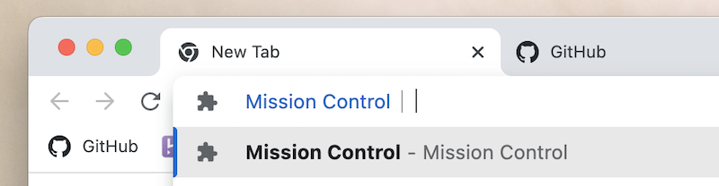
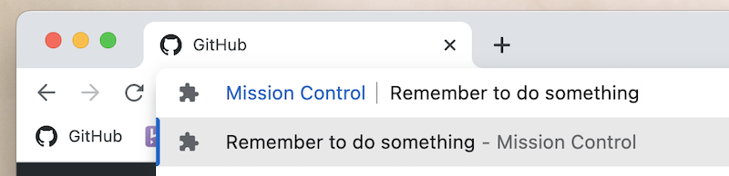
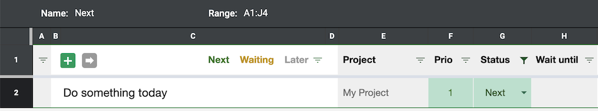
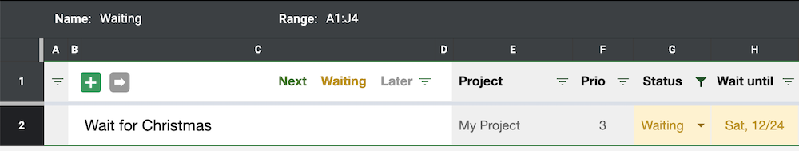
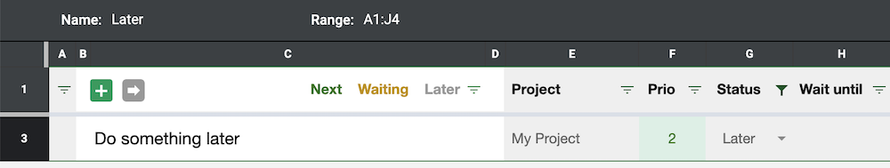
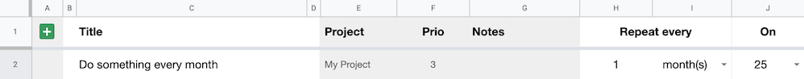
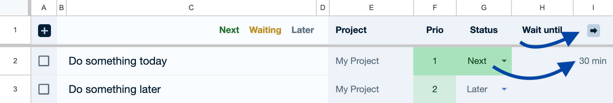

# 🚀 Mission Control

A simple and customisable backlog system for Google Workspace users that helps you with ["Getting Things Done"](https://en.wikipedia.org/wiki/Getting_Things_Done).

- **Easy entry from anywhere:** Add to-dos from any Chrome tab and any device
- **Stay focused:** Snooze to-dos, assign priorities and automatically block time on your calendar, so you can focus only what's important to you now
- **All your to-dos in one place:** Pull to-dos from other Workspace services like Gmail, so you can manage all your work in one place

## Getting Started

To get started, you will have to copy a few files and configure a few variables. Don't worry though, it should not take more than just a few minutes.

1. Make a copy of [this spreadsheet](https://docs.google.com/spreadsheets/d/1T5oizbxcr-_fVzoKcx92o2PO_DikLpdj8o8_cv7lvPc/edit?usp=sharing&resourcekey=0-aHUjSv69rN8c3A76sPSxDA) with the Google Account that you'd like to use. Since this will be your to-do list from now on, you might want to bookmark it somewhere.
2. Open the spreadsheet and go to `Extensions` > `Apps Script`.
3. Copy each file from the `apps_script` folder in this repository into your new Apps Script project. It's fine to rename files or change the folder hierarchy.
4. Go to `Extensions` > `Apps Script` and click the settings icon. Make sure your timezone is selected in your project settings.
5. Reload the spreadsheet, open the `Custom` menu at the top and click `Install triggers if needed`. This will install Apps Script triggers to keep your backlog up to date in the background.

Next, configure a few required Apps Script variables:

1. Open `config/scheduler_config.gs` and set the value of `SchedulerConfig.CALENDAR_ID` to the ID of your Google calendar. This will allow you to easily [block time on your calendar](#block-time-on-your-calendar) for your to-dos. You can find the ID of your calendar in your calendar settings. If you want to use your main calendar, simply enter the email address of your Workspace account, for example max@example.com.
2. Open `config/inbox_importer.gs` and set the value of `InboxImporterConfig.EMAIL_ADDRESS` to the email address of your Workspace account. This will allow you to [add to-dos remotely](#create-a-new-to-do-from-your-other-devices) by sending yourself an email.

To be able to quickly open your to-do list and add items from Chrome's Omnibox, also install the 'Mission Control' Chrome extension:

1. Download the `chrome_extension` folder to your computer. If you like, you can rename the folder to something else.
2. Open `background.js`.
3. Replace the value of `SPREADSHEET_ID` with the ID of the spreadsheet you created above. You can find the ID in the URL of your spreadsheet: `https://docs.google.com/spreadsheets/d/SPREADSHEET_ID/edit`
4. Open `manifest.json`.
5. Replace the value of `"client_id"` under `"oauth2"` with a valid [Google Cloud Platform OAuth client ID](https://developer.chrome.com/docs/extensions/mv3/tut_oauth/#oauth_client) that grants you access to the Google Sheets API (read and write access).
6. Open Chrome and go to `chrome://extensions`.
7. Turn on "Developer mode" in the top right corner.
8. Click "Load unpacked" and select the `chrome_extension` folder you downloaded earlier.

## Using Mission Control

### Open your backlog from anywhere in Chrome

To quickly access your backlog while in Chrome, type `mc` (for **M**ission **C**ontrol) into the Omnibox and hit `SPACE` or `TAB`. Hit `ENTER` and your backlog will open in a new pinned tab. If your backlog is already open, Chrome will simply navigate to the existing tab.

Similarly, you can quickly navigate to Gmail, Meet and Calendar by typing `mc`, `SPACE` and then `g` (for Gmail), `m` (for Meet), or `c` (for Calendar), respectively.

### Create a new to-do from anywhere in Chrome

To create a new to-do from anywhere in Chrome, type `mc` into the Omnibox and hit `SPACE` or `TAB`. Type in a title for your new to-do and hit `ENTER`. Chrome will add a new to-do to the top of your backlog.

### Create a new to-do from your other devices

If you're not on your computer, you can add to-dos to your backlog remotely. Simply send an email with the title of your to-do as the subject line to your Gmail address with `+todo` added to your user name, for example max+todo@example.com. It may take a few minutes until new to-dos will be moved from your inbox to your backlog.

### Organise, view and snooze your to-dos

There are three views you should commonly use to browse and manage your to-dos:

#### "Next" view

**"Next"** is your **focus view** and includes only items with a `Next` status or without a status. Use this view to decide what to do next – and what not to worry about just yet. Make sure this view only includes items you really plan to do next, say within a day or two. Don't use it as a catch-all bucket. If you don't have the time or energy to deal with an item just yet, consider setting the status to `Waiting` or `Later`, so you can take another look at a better time.

#### "Waiting" view

**"Waiting"** is your **monitoring view** and contains only items with a `Waiting` status. You should move two types of items into this view: 1) Items that you need to keep an eye on but that are not yet actionable – for example when you're waiting for someone's response. 2) Items that you don't have the time or energy to work on right now but you know roughly when you want to take another look at them.

To set an item's status to `Waiting`, enter a date in the `Wait until` column. The item will be **snoozed** and scheduled to reappear in your `Next` view on the given date. This helps you make sure you don't drop the ball on important to-dos while keeping your focus view ... well ... focused on just the things you can and want to work on at the moment.
 
There are a few easy ways to snooze an item:

- Type a positive integer into the `Wait until` column to snooze an item for a number of days.
- Type a three-letter day, for example "Mon", into the `Wait until` column to snooze an item until the next instance of the given weekday.
- Enter a date, for example "Aug 9", into the `Wait until` column.

#### "Later" view

**"Later"** is your **backlog view** and includes only items with a `Later` status. Use this view to manage all the to-dos that you want to keep in your backlog for later review, so you can come back to them at some point and decide when and how to deal with them. Make sure you review them regularly and delete obsolete items, so your **"Later"** view doesn't become a unmanageable black hole of stale to-dos. Pro tip: add a [recurring item](#add-recurring-to-dos) to review your "Later" items once a week.

### Add recurring to-dos

To create a new recurring to-do, open the 'Recurring' sheet and click on the plus icon in the first row and enter a title, a cadence and the remaining columns in whatever way you see fit.

To integrate with other services, for example to remind you to read the emails you labelled in Gmail for later consumption on a quieter day, you can add **script-based recurring to-dos** that call your own Apps Script to generate a new to-do with a dynamic content. For that, you can add a new function to `apps_script/recurring.gs` and have it return `null` or an instance of `BacklogItem` as defined in `apps_script/backlog.gs`. Then place a valid JavaScript call of your custom function into the `Title` field, e.g. `functionThatReturnsARecurringToDo();`.

### Block time on your calendar

If you want to organise your day and block time on your calendar for your to-dos, you can have Mission Control add calendar events for your to-dos. Type in the number of minutes you'd like to block for each to-do into column A and click on the 'Schedule' icon:

Mission Control will look for free slots on your calendar and create events for each to-do, so you can take control over your day and make sure you allocate enough time for everything you'd like to get done. Calendar events are private by default but will show up as "busy" in your calendar.

### Work from a different timezone

If you are working from a different timezone than usually, make sure to update the script timezone accordingly as described in the [Getting Started](#getting-started) section.
