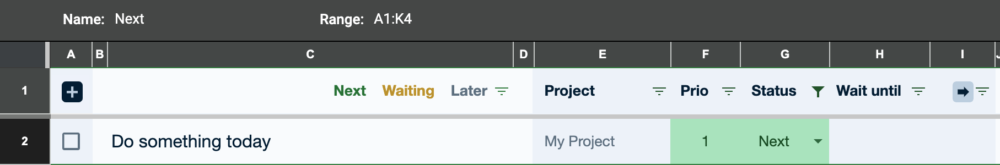
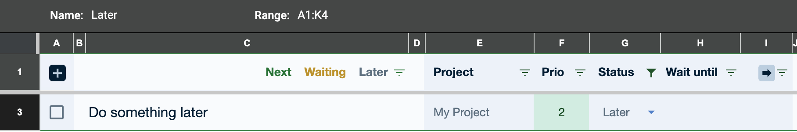
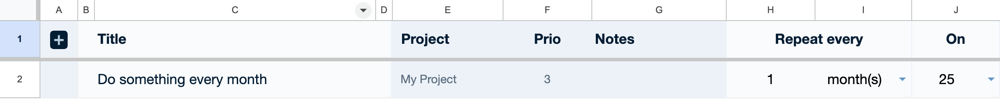

# 🚀 Mission Control

A simple and customisable backlog system for Google Workspace users that helps you with ["Getting Things Done"](https://en.wikipedia.org/wiki/Getting_Things_Done).

- **Quickly add to-dos from anywhere:** Add to-dos from anywhere in Chrome via the address bar, or per email from other devices
- **Stay focused and manage your time:** Snooze to-dos, assign priorities and automatically block time on your calendar
- **Manage your to-dos efficiently:** View and edit your to-dos fast and easily in a Google Sheet
- **Keep everything in one place:** Use Apps Script to pull to-dos from other Workspace services like Gmail, so you can manage all your work in one place
- **Purely Workspace-based:** Workspace is all you need. No need to buy additional subscriptions or save confidential data outside of Workspace.

## Getting Started

To get started, copy and configure the files below. Don't worry, that shouldn't take more than a few minutes.

1. Make a copy of [this spreadsheet](https://docs.google.com/spreadsheets/d/1T5oizbxcr-_fVzoKcx92o2PO_DikLpdj8o8_cv7lvPc/edit?usp=sharing&resourcekey=0-aHUjSv69rN8c3A76sPSxDA) with the Google Account that you'd like to use.
2. Open the spreadsheet and go to `Extensions` > `Apps Script`.
2. Go to `Editor` and copy each `.js` file from the `apps_script` folder in this repository into your new Apps Script project as a `.gs` file. It's fine to rename files or change the folder hierarchy. Alternatively, you can use [clasp](https://github.com/google/clasp) to push the files to your project.
2. Select `Editor`. Then, next to `Services`, click `+` and add the [`Google Calendar API`](https://developers.google.com/apps-script/advanced/calendar).

Next, configure the required script variables:

1. Open the spreadsheet and go to `Extensions` > `Apps Script`.
2. Go to `Project Settings`.
2. Make sure the correct time zone is selected under `General settings`.
2. Go to `Script Properties` at the bottom.
2. Add a new property `SchedulerConfig.CALENDAR_ID` and set the value to the ID of your Google calendar. This will allow you to easily [block time on your calendar](#block-time-on-your-calendar) for your to-dos. You can find the ID of your calendar in your calendar settings. If you want to use your main calendar, enter the email address of your Workspace account, for example `max@example.com`.
2. Add a new property `InboxImporterConfig.EMAIL_ADDRESS` set the value to the email address of your Gmail account. This will allow you to [add to-dos remotely](#create-a-new-to-do-from-your-other-devices) by sending yourself an email.
2. Optionally, override any of the default settings defined in `apps_scipt/config.js` by setting additional properties.
2. Open the spreadsheet, open the `Custom` menu at the top and click `Install triggers if needed`. This will install Apps Script triggers to keep your backlog up to date in the background.

To quickly open your to-do list and add items from Chrome's address bar, also install the Chrome extension:

1. Deploy the apps script project above as a [web app](https://developers.google.com/apps-script/guides/web#deploy_a_script_as_a_web_app). Make sure the web app is accessible only to you.
2. Download the `chrome_extension` folder in this repository to your computer. You can rename the folder to something else if you like.
2. Open `config.local.js`.
2. Replace the value of `WEB_APP_DEPLOYMENT_URL` with the URL to the deployment above.
2. Replace the value of `SPREADSHEET_ID` with the ID of the spreadsheet you created above. You can find the ID in the URL of your spreadsheet: `https://docs.google.com/spreadsheets/d/SPREADSHEET_ID/edit`
2. Open Chrome and go to `chrome://extensions`.
2. Turn on "Developer mode" in the top right corner.
2. Click "Load unpacked" and select the `chrome_extension` folder you downloaded earlier.

## Using Mission Control

### Open your backlog

To quickly access your backlog while in Chrome, hit `Ctrl + M` (for **M**ission Control) and your backlog will open in a new pinned tab. If your backlog is already open, Chrome will navigate to the existing tab.

Go to `chrome://extensions/shortcuts` to change these shortcuts or make them available outside of Chrome.

### Create a new to-do

To create a new to-do from anywhere in Chrome, type `m` into the address bar and hit `SPACE` or `TAB`. Type in a title for your new to-do and hit `ENTER`. Chrome will add a new to-do to the top of your backlog.

You can enter additional information directly from the address bar:

- Assign to-do to a **project** by entering `#project:` followed by a project name. If a project name contains whitespace, make sure to wrap everything in parentheses.
- Set a **priority** by entering `#prio:`, followed by the desired priority.
- Set a **date** until which to snooze a to-do by entering `#when:`, followed by any of the expressions to snooze items [described below](#waiting-view). You can use `0` to set the status to `Next`.
- **Block time** on your calendar by entering `#calendar:` followed by a duration in minutes. If used together with `#when:`, time will be blocked on the provided date.
- **Add links** to the item's title in markdown format, e.g. `[my link](www.example.com)`.

### Create a new to-do from your other devices

If you're not on your computer, you can add to-dos to your backlog remotely. Send an email with the title of your to-do as the subject line to your Gmail address with `+todo` added to your user name, for example max+todo@example.com. On iPhone, iPad and Mac, you can install this [Shortcut](https://www.icloud.com/shortcuts/44c0ff01b0a64377b22dcdd6592c26ec) to add to-dos with a few simple taps.

### Organise, view and snooze your to-dos

There are three views you should commonly use to browse and manage your to-dos:

#### "Next" view

**"Next"** is your **focus view** and includes only items with a `Next` status or without a status. Use this view to decide what to do next – and what not to worry about just yet. Make sure this view only includes items you really plan to do next, say within a day or two. Don't use it as a catch-all bucket. If you don't have the time or energy to deal with an item just yet, consider setting the status to `Waiting` or `Later`, so you can take another look at a better time.

#### "Waiting" view

**"Waiting"** is your **view into the future** and contains only items with a `Waiting` status. You should move two types of items into this view: 1) Items that you need to keep an eye on but that are not yet actionable – for example when you're waiting for someone's response. 2) Items that you don't have the time or energy to deal with right now but you know roughly when it's time to take another look.

To set an item's status to `Waiting`, enter a date in the `Wait until` column. The item will be **snoozed** and automatically show up again in your `Next` view on the chosen date. This helps you make sure you don't drop the ball on something important while keeping your focus view ... well ... focused on just the things you really need to work on right now.
 
There are a few easy ways to snooze an item:

- Type a positive integer into the `Wait until` column to snooze an item for a number of days.
- Type a three-letter day, for example "Mon", into the `Wait until` column to snooze an item until the next instance of the given weekday. To schedule an item a few weeks ahead, append "+" and the desired number of weeks, for example "Mon+3".
- Enter a date, for example "Aug 9", into the `Wait until` column.

#### "Later" view

**"Later"** is your **backlog view** and includes only items with a `Later` status. Use this view to manage all the to-dos that you want to keep in your backlog for later review, so you can come back to them at some point and decide when and how to deal with them. Make sure you review them regularly and delete obsolete items, so your **"Later"** view doesn't become a unmanageable black hole of stale to-dos. Pro tip: add a [recurring item](#add-recurring-to-dos) to review your "Later" items once a week.

#### Switch views via shortcuts

While on the Mission Control sheet, you can switch views using your keyboard. Go to `chrome://extensions/shortcuts` to set up these shortcuts.

#### Mark to-do as done

To mark a to-do as done, click on the checkbox in the first column. You can also press `Cmd + .` (Mac) or `Ctrl + .` (Windows) to mark selected rows as done.

### Block time on your calendar

If you want to organise your day and block time on your calendar for your to-dos, you can have Mission Control add calendar events for your to-dos. Type in the number of minutes you'd like to block for each to-do into column I and click on the 'Schedule' icon:

Mission Control will look for free slots on your calendar and create events for each to-do, so you can take control over your day and make sure you allocate enough time for everything you'd like to get done. Calendar events are private by default but will show up as "busy" in your calendar.

If you move a scheduled event to a different time in the future, Mission Control will update the corresponding to-do accordingly.

### Create recurring to-dos

To create a recurring to-do, open the 'Recurring' sheet and click on the "+" icon in the first row. Then enter a title, a cadence and fill in the remaining columns as you see fit.

To integrate with other services, for example to remind you to read the emails you labelled in Gmail for later consumption on a quieter day, you can add **script-based recurring to-dos** that call your own Apps Script to generate a new to-do with a dynamic content. Add a new function to `apps_script/recurring.gs` and have it return an instance of `BacklogItem` as defined in `apps_script/backlog.gs`. Then place a valid JavaScript call of your custom function into the `Title` field, e.g. `functionThatReturnsARecurringToDo();`.

You can temporarily pause all recurring to-dos by setting the script property `BacklogConfig.SCHEDULE_RECURRING_ITEMS_PAUSED_UNTIL` to a date string (e.g., `2025-10-15`) to pause until that date.
